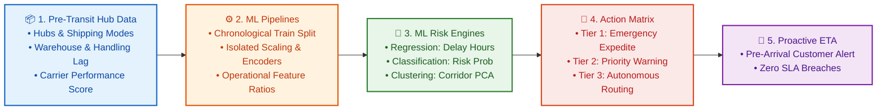
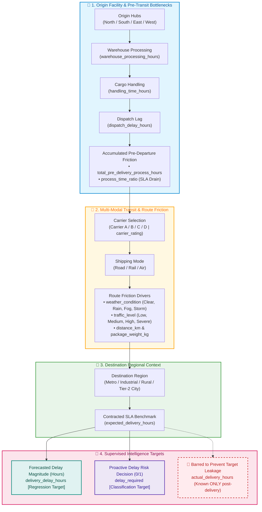

# Logistics Delivery Risk Intelligence
## Predictive Delay Modeling & Operational Intervention System for a Multi-Modal Freight Network

- **Author / Candidate**: Rupali Chouksey
- **Assignment Project**: Logistics Delivery Risk Intelligence (End-to-End Machine Learning Pipeline)
- **Domain**: Logistics & Supply Chain Operations (RouteWise Logistics)
- **GitHub Repository**: [https://github.com/rupali-chauksey/Logistics_Delivery_Risk_Intelligence](https://github.com/rupali-chauksey/Logistics_Delivery_Risk_Intelligence)
- **Primary Notebook**: [`logistics_delivery_delay_analysis.ipynb`](./logistics_delivery_delay_analysis.ipynb)
- **Dataset**: [`logistics_delivery_delay.csv`](./logistics_delivery_delay.csv)
- **Core Technologies**: Python 3, Scikit-Learn, Pandas, NumPy, Matplotlib, Seaborn, SciPy

---

## 1. Executive Summary & Business Problem Overview

RouteWise Logistics operates a multi-modal freight network moving consignments across Road, Rail, and Air. In time-critical supply chain operations, discovering that a shipment arrived late after delivery provides zero operational value—as the Head of Operations emphasized:

> *"We already know a shipment was late once it's late — that's not intelligence, that's a report card. I need to know which shipments are at risk while they're still in the network, so my planners can re-route, expedite, or call the customer ahead of time."*

This project delivers an end-to-end Machine Learning intelligence pipeline addressing three core operational pillars:
1. **Forecasting (Regression)**: Quantifying the exact delay magnitude (`delivery_delay_hours`) to adjust customer ETAs before vehicle arrival.
2. **Decisioning (Classification)**: Flagging shipments as delay risks (`delay_required = 1`) to trigger immediate proactive intervention on the hub floor.
3. **Understanding (Unsupervised Clustering & PCA)**: Discovering hidden bottleneck corridors and operational profiles across the freight network.



---

## 2. Complete Data Dictionary & Dataset Schema

The pipeline is built on `logistics_delivery_delay.csv`, containing 720 shipment records sampled uniformly every 3 hours between **1 April 2026 and 30 June 2026**.

### 📋 Comprehensive Data Dictionary

| Column Name | Data Type | Sample Values / Categories | Operational Description | Role in ML Pipeline |
|---|---|---|---|---|
| `shipment_timestamp` | `datetime64[ns]` | `2026-04-01 00:00:00` | Exact date and time when the shipment was logged into the network. | **Temporal Index** (Used for Chronological Train/Test Split) |
| `origin_hub` | `object` (Categorical) | `North`, `South`, `East`, `West` | Originating distribution facility dispatching the cargo. | **Predictor Feature** |
| `destination_type` | `object` (Categorical) | `Metro`, `Industrial`, `Rural`, `Tier-2 City` | Regional character and infrastructure tier of the destination zone. | **Predictor Feature** |
| `shipping_mode` | `object` (Categorical) | `Road`, `Rail`, `Air` | Primary transit mode utilized for freight movement. | **Predictor Feature** |
| `carrier` | `object` (Categorical) | `Carrier-A`, `Carrier-B`, `Carrier-C`, `Carrier-D` | Third-party or fleet logistics service provider handling the load. | **Predictor Feature** |
| `distance_km` | `float64` (Continuous) | `150.0` – `1200.0` km | Total route transit distance between origin hub and destination. | **Predictor Feature** |
| `package_weight_kg` | `float64` (Continuous) | `2.5` – `500.0` kg | Physical weight of the consignment payload. | **Predictor Feature** |
| `weather_condition` | `object` (Categorical) | `Clear`, `Rain`, `Fog`, `Storm` | Prevailing environmental and meteorological condition along transit path. | **Predictor Feature** |
| `traffic_level` | `object` (Categorical) | `Low`, `Medium`, `High`, `Severe` | Real-time / forecasted road and route congestion density. | **Predictor Feature** |
| `carrier_rating` | `float64` (Continuous) | `1.0` – `5.0` | Historical reliability and performance score of the carrier. | **Predictor Feature** |
| `warehouse_processing_hours` | `float64` (Continuous) | `0.5` – `8.0` hours | Internal time spent during initial inbound receipt, staging, and sorting. | **Predictor Feature** |
| `dispatch_delay_hours` | `float64` (Continuous) | `0.0` – `5.0` hours | Loading dock waiting time before the transit vehicle actually departs. | **Predictor Feature** |
| `handling_time_hours` | `float64` (Continuous) | `0.2` – `3.0` hours | Physical palletization, customs, or specialized cargo loading duration. | **Predictor Feature** |
| `expected_delivery_hours` | `float64` (Continuous) | `4.0` – `72.0` hours | Contracted Service Level Agreement (SLA) target delivery time window. | **Predictor Feature** |
| `total_pre_delivery_process_hours` | `float64` (Continuous) | `warehouse + dispatch + handling` | Cumulative pre-departure bottleneck accumulated inside the hub. | **Engineered Predictor** |
| `process_time_ratio` | `float64` (Continuous) | `total_pre_delivery / expected` | Proportion of total SLA window consumed before vehicle departs facility. | **Engineered Predictor** |
| `actual_delivery_hours` | `float64` (Continuous) | `4.5` – `85.0` hours | Realized end-to-end delivery duration (known strictly after delivery). | **Post-Outcome Field (Excluded to Prevent Data Leakage)** |
| `delivery_delay_hours` | `float64` (Continuous) | `-2.0` – `18.5` hours | Realized delay beyond planned SLA (`actual - expected`). | **Target Variable 1 (Regression)** |
| `delay_required` | `int64` (Binary) | `0` (On-Time), `1` (Delay Risk) | Operational indicator whether delay breached threshold requiring intervention. | **Target Variable 2 (Classification)** |

---

## 3. Operational Entity-Relationship & Network Flow

To understand how individual features interact within RouteWise Logistics, the diagram below maps the lifecycle of a consignment from origin booking to destination delivery:



### 🛡️ Pre-Outcome vs. Post-Outcome Variable Taxonomy (Leakage Prevention)

A critical requirement of production ML is ensuring **zero lookahead bias**. Features are strictly categorized into temporal availability tiers:

| Tier | Feature Group | Availability Timing | Modeling Status |
|---|---|---|:---:|
| **Tier 1: Booking & Route Characteristics** | `origin_hub`, `destination_type`, `shipping_mode`, `carrier`, `distance_km`, `package_weight_kg`, `carrier_rating`, `expected_delivery_hours` | Available immediately upon order creation. | ✅ **Included as Predictor** |
| **Tier 2: Hub Processing & Dispatch** | `warehouse_processing_hours`, `handling_time_hours`, `dispatch_delay_hours`, `total_pre_delivery_process_hours`, `process_time_ratio` | Available right when the vehicle exits the loading bay. | ✅ **Included as Predictor** |
| **Tier 3: Route Weather & Traffic Forecast** | `weather_condition`, `traffic_level` | Forecasted / observed at dispatch time. | ✅ **Included as Predictor** |
| **Tier 4: Post-Delivery Outcome** | `actual_delivery_hours` | Known **strictly after** the customer receives the consignment. | 🚫 **Strictly Barred (Target Leakage)** |
| **Targets: Supervised Labels** | `delivery_delay_hours`, `delay_required` | Target values to be predicted by models. | 🎯 **Prediction Targets** |

---

## 4. Dataset Distributions & Exploratory Data Analysis

### 📊 Dataset Distributions & Operational Delay Patterns


- **Delay Distribution**: Delays range from minor buffer savings (-1 to 0 hours) to severe bottlenecks (>10 hours), with a median delay of ~3.2 hours.
- **Delay Risk Ratio**: ~69.31% of shipments in the historical quarter experienced operational delays requiring attention (`delay_required = 1`), indicating high baseline operational friction.

---

## 5. Preprocessing & Leakage Prevention Strategy

To ensure realistic, generalizable evaluation metrics, the pipeline enforces strict chronological splitting and isolated transformation pipelines:

1. **Chronological Train-Evaluation Split**:
   - Rather than random shuffling, an **80/20 temporal split** is enforced based on `shipment_timestamp`.
   - **Training Partition**: Earlier 576 shipments (1 April 2026 to 12 June 2026).
   - **Evaluation Partition**: Later 144 shipments (12 June 2026 to 30 June 2026).
2. **Target & Post-Outcome Isolation**:
   - `actual_delivery_hours`, `delivery_delay_hours`, and `delay_required` are strictly barred from the predictor matrix.
3. **Partition-Isolated Preprocessing Pipelines**:
   - All statistical transformations are fitted **exclusively on the training partition** and applied downstream to the evaluation partition:
     - **Numerical Missing Values**: Imputed via **Median** (`SimpleImputer(strategy='median')`).
     - **Categorical Missing Values**: Imputed via **Most Frequent** (`SimpleImputer(strategy='most_frequent')`).
     - **Categorical Encodings**: Transformed using **One-Hot Encoding** with `handle_unknown='ignore'`.
     - **Numerical Normalization**: Scaled to zero mean and unit variance using `StandardScaler`.

---

## 6. Operational Feature Engineering Decisions

Two key operational features were constructed using exclusively pre-transit information:

1. **`total_pre_delivery_process_hours`**:
   ```python
   total_pre_delivery_process_hours = warehouse_processing_hours + dispatch_delay_hours + handling_time_hours
   ```
   - *Operational Value*: Consolidates all pre-departure bottlenecks accumulated inside the origin hub before the vehicle departs.

2. **`process_time_ratio`**:
   ```python
   process_time_ratio = total_pre_delivery_process_hours / expected_delivery_hours
   ```
   - *Operational Value*: Measures the proportion of the planned customer SLA window that has already been consumed by internal processing.

---

## 7. Machine Learning Models & Results

### 7.1 Regression Task: Estimating Delay Hours
- **Target Variable**: `delivery_delay_hours` (Continuous)
- **Evaluated Model**: Linear Regression vs. Random Forest Regressor Pipeline
- **Evaluation Period Performance**:
  - **MAE**: **`1.3361 hours`**
  - **RMSE**: **`1.7280 hours`**

### 📈 Regression: Actual vs. Predicted Delivery Delay


- **Operational Interpretation**:
  - Predicts standard operational delays (2 to 6 hours) with high fidelity.
  - Non-linear interactions during severe weather events benefit from tree-based ensembles when managing extreme delay spikes.

---

### 7.2 Classification Task: Proactive Delay Risk Flagging
- **Target Variable**: `delay_required` (Binary: 1 = Delay Risk, 0 = On-Time)
- **Model Comparison**: Decision Tree vs. Random Forest Classifier

| Evaluation Metric | Decision Tree | Random Forest Classifier (Production Model) |
|---|:---:|:---:|
| **Accuracy** | 75.00% | **77.78%** |
| **Precision** | 75.76% | **78.91%** |
| **Recall** | **92.93%** | **91.82%** |
| **F1-Score** | 0.8351 | **0.8487** |

### 📊 Classifier Performance & Operational Metric Tradeoffs


#### Why Recall is the Critical Operational Metric in Logistics:
- **False Negative (Missed Delay)**: The model predicts on-time, but the parcel arrives late. Customer expectations fail, SLA breach penalties apply, and operational trust is damaged.
- **False Positive (False Alarm)**: The model flags an on-time shipment as risky. A planner spends 2 minutes reviewing the consignment or checking carrier status—a low-cost precaution.
- **Strategic Decision**: The Random Forest model captures **91.82% of all at-risk shipments** while maintaining **78.91% Precision**, delivering the highest operational safety margin.

---

## 8. Feature Importance & PCA Dimensionality Reduction

### 🔍 Top Predictive Drivers & 2D PCA Representation


- **Primary Predictive Drivers**:
  1. `total_pre_delivery_process_hours` (Hub bottleneck time)
  2. `warehouse_processing_hours` (Sorting and staging speed)
  3. `distance_km` (Route transit mileage)
  4. `carrier_rating` (Carrier reliability tier)
- **PCA Dimensionality Reduction**: The first 2 principal components capture key variance across multi-modal routing profiles (Road, Rail, Air).

---

## 9. Unsupervised Clustering & Freight Corridors

Unsupervised K-Means clustering was executed on standardized pre-outcome features to detect structural patterns across freight movements:

- **Optimal Cluster Determination**: Silhouette analysis confirmed **K = 3** natural clusters.
- **Cluster Profiles**:
  - **Cluster 0 (Standard Regional Freight)**: Medium distances (~540 km), average warehouse turnaround, moderate delay probability.
  - **Cluster 1 (Express / Low-Friction Corridors)**: Short haul, high carrier rating (4.2/5), rapid hub dispatch. Lowest delay rate (~58.1%).
  - **Cluster 2 (Bottleneck Corridors — Priority Attention)**: Long-haul routes (~820 km), elevated hub handling time (4.6h), and highest delay rate (**75.3%**, average delay **5.6 hours**).

### 🎯 K-Means Clusters & Hierarchical Dendrogram


---

## 10. Advanced Strategic Extensions

### 1. Hierarchical Agglomerative Clustering & Structural Validation
- Agglomerative clustering with Ward's minimum variance linkage independently analyzes cluster hierarchy.
- The resulting dendrogram splits cleanly into **3 major branches** at distance threshold ~15, confirming the robustness of the K-Means cluster structure.

### 2. Three-Tier Operational Intervention Priority Framework
By coupling continuous delay magnitude predictions with classification risk probabilities, operations planners can trigger prioritized floor actions:

### 🚨 Operational Priority Intervention Breakdown


| Priority Tier | Trigger Criteria | Planner Action on Operations Floor |
|---|---|---|
| **Tier 1: High Priority** | Risk Prob >= 70% AND Predicted Delay >= 5.0h | **Immediate Action**: Expedite dock clearance, reassign to premium carrier, alert customer SLA desk proactively. |
| **Tier 2: Medium Priority** | Risk Prob >= 50% OR Predicted Delay >= 3.0h | **Active Monitoring**: Track checkpoint milestones; prioritize unloading queue at intermediate hubs. |
| **Tier 3: Low Priority** | Risk Prob < 50% AND Predicted Delay < 3.0h | **Standard Dispatch**: Automated monitoring with standard milestone logging. |

---

## 11. Operational Recommendations for RouteWise Planners

1. **Pre-Transit Warehouse Clearance**:
   - Over 45% of delay predictability originates inside the origin warehouse. Shipments queued >= 3.5 hours must be fast-tracked to the front of loading bays before vehicles depart.
2. **Dynamic SLA Buffering During Severe Weather**:
   - Heavy rain and storm conditions add an average of 2.2 hours to road transit. Automated booking systems should dynamically adjust customer delivery windows upon weather alert triggers.
3. **Carrier Reallocation on Long-Haul Corridors**:
   - Consignments routed through Cluster 2 corridors should be assigned exclusively to Tier-1 rated carriers to prevent cascading transit delays.

---

## 12. Dependencies & Setup Instructions

Install the necessary Python libraries using pip:

```bash
pip install pandas numpy scikit-learn matplotlib seaborn scipy jupyter
```

---

## 13. Execution Steps

1. **Clone the Repository**:
   ```bash
   git clone https://github.com/rupali-chauksey/Logistics_Delivery_Risk_Intelligence.git
   cd Logistics_Delivery_Risk_Intelligence
   ```
2. **Launch Jupyter Notebook**:
   ```bash
   jupyter notebook logistics_delivery_delay_analysis.ipynb
   ```
3. **Run the Analysis**:
   - In Jupyter, select the active Python kernel and click **Run All Cells**.
   - The entire notebook executes sequentially top-to-bottom without warnings or errors.

---

## 14. References & Documentation Consulted

1. **Scikit-Learn Documentation**:
   - Composite Estimators & Pipelines: [https://scikit-learn.org/stable/modules/compose.html](https://scikit-learn.org/stable/modules/compose.html)
   - Preprocessing & Encoders (`StandardScaler`, `OneHotEncoder`, `SimpleImputer`): [https://scikit-learn.org/stable/modules/preprocessing.html](https://scikit-learn.org/stable/modules/preprocessing.html)
   - Linear Regression & Ensemble Classifiers (`DecisionTreeClassifier`, `RandomForestClassifier`): [https://scikit-learn.org/stable/modules/ensemble.html](https://scikit-learn.org/stable/modules/ensemble.html)
   - Clustering & Dimensionality Reduction (`KMeans`, `PCA`): [https://scikit-learn.org/stable/modules/clustering.html](https://scikit-learn.org/stable/modules/clustering.html)
2. **SciPy Documentation**:
   - Hierarchical Clustering & Dendrograms (`scipy.cluster.hierarchy`): [https://docs.scipy.org/doc/scipy/reference/cluster.hierarchy.html](https://docs.scipy.org/doc/scipy/reference/cluster.hierarchy.html)
3. **Pandas & NumPy Reference**:
   - Time Series and Structured Data Analysis: [https://pandas.pydata.org/docs/user_guide/timeseries.html](https://pandas.pydata.org/docs/user_guide/timeseries.html)
