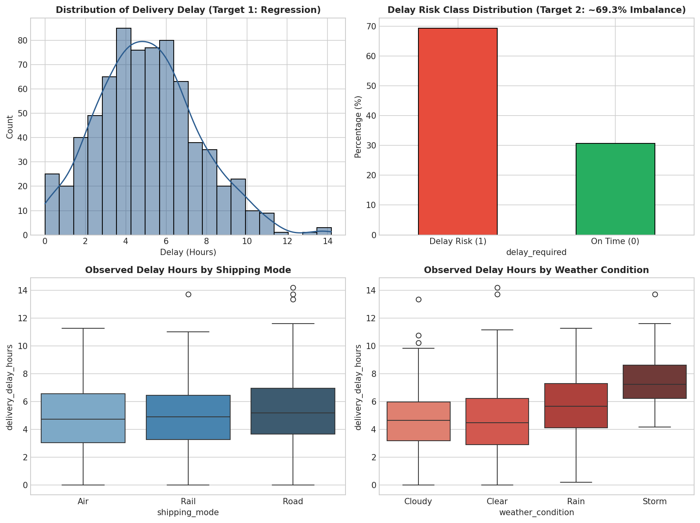
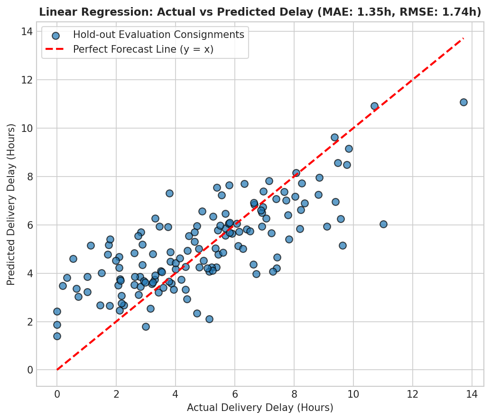
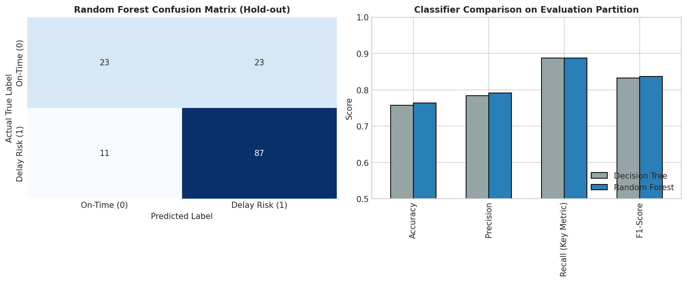
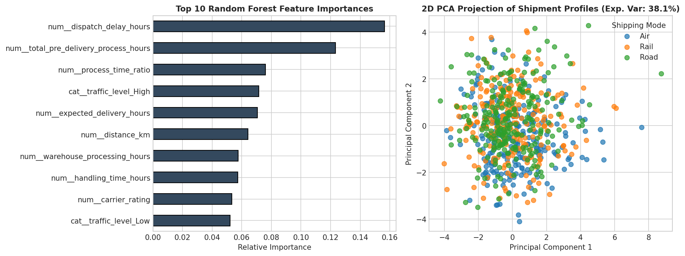
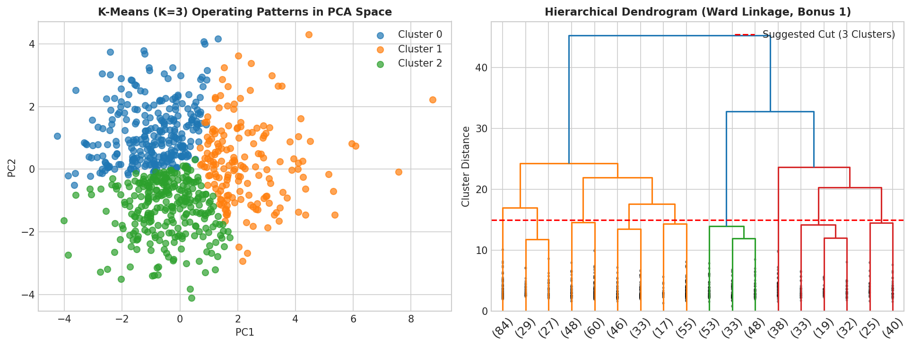
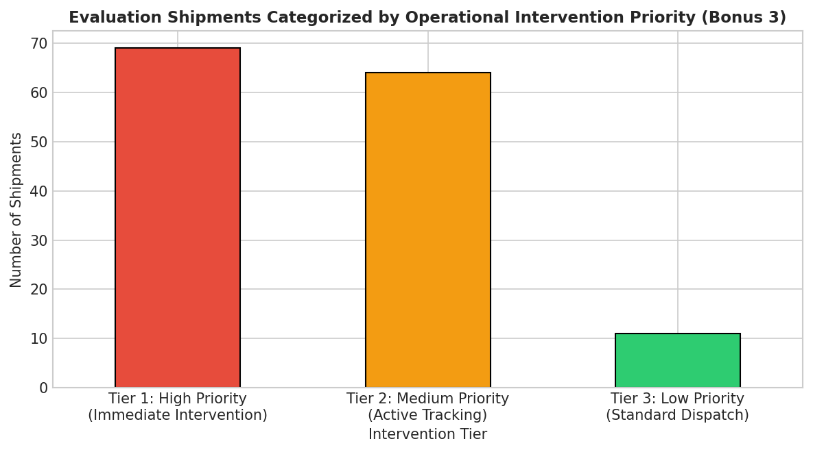

# Logistics Delivery Risk Intelligence
## Delivery Delay Prediction & Operational Intervention for a Multi-Modal Logistics Network

- **Domain**: Logistics & Supply Chain Operations (RouteWise Logistics)
- **Notebook**: [`logistics_delivery_delay_analysis.ipynb`](./logistics_delivery_delay_analysis.ipynb)
- **Dataset**: [`logistics_delivery_delay.csv`](./logistics_delivery_delay.csv)
- **Language & Frameworks**: Python 3, Scikit-Learn, Pandas, NumPy, Matplotlib, Seaborn, SciPy

---

## 1. Project & Business Problem Overview

RouteWise Logistics operates a multi-modal freight network moving consignments across Road, Rail, and Air. In time-critical logistics, discovering that a shipment arrived late after delivery provides zero actionable value—as the Head of Operations emphasized:

> *"We already know a shipment was late once it's late — that's not intelligence, that's a report card. I need to know which shipments are at risk while they're still in the network, so my planners can re-route, expedite, or call the customer ahead of time."*

This project implements an end-to-end Machine Learning intelligence pipeline addressing three core operational pillars:
1. **Forecasting (Regression)**: Estimating the exact delay magnitude (`delivery_delay_hours`) for a given consignment.
2. **Decisioning (Classification)**: Proactively flagging shipments as delay risks (`delay_required = 1`) for immediate planner intervention.
3. **Understanding (Unsupervised Clustering & PCA)**: Discovering recurring operating patterns and bottleneck corridors across the network.

---

## 2. Dataset Architecture & Exploratory Data Analysis

The project is built on `logistics_delivery_delay.csv`, containing 720 shipment records sampled every 3 hours between **1 April 2026 and 30 June 2026**.

| Property | Details |
|---|---|
| **Total Records** | 720 shipments |
| **Total Features** | 17 columns (14 predictors, 1 post-outcome field, 2 targets) |
| **Time Period** | 1 April 2026 – 30 June 2026 (sampled every 3 hours) |
| **Origin Hubs** | North, South, East, West (180 shipments each) |
| **Destination Types** | Metro, Industrial, Rural, Tier-2 City (180 shipments each) |
| **Shipping Modes** | Road (240), Rail (240), Air (240) |
| **Carriers** | Carrier-A, Carrier-B, Carrier-C, Carrier-D (180 shipments each) |
| **Regression Target** | `delivery_delay_hours` (Realized delay beyond expected hours) |
| **Classification Target** | `delay_required` (Binary flag: 1 = delay risk, 0 = on-time) |
| **Post-Outcome Field** | `actual_delivery_hours` (Determined strictly after final delivery) |
| **Target Imbalance** | ~69.31% positive class rate (imbalanced towards delays) |

### 📊 Dataset Distributions & Operational Delay Patterns


---

## 3. Preprocessing & Leakage Prevention Strategy

To prevent data leakage and lookahead bias, the pipeline enforces strict validation safeguards:

1. **Chronological Train-Evaluation Split**:
   - Rather than random shuffling, an **80/20 chronological split** was applied based on `shipment_timestamp`.
   - **Training Set**: Earlier 576 shipments (1 April 2026 to 12 June 2026).
   - **Evaluation Set**: Later 144 shipments (12 June 2026 to 30 June 2026).
2. **Post-Outcome & Target Isolation**:
   - `actual_delivery_hours`, `delivery_delay_hours`, and `delay_required` were strictly excluded from every predictor feature matrix.
3. **Partition-Isolated Preprocessing Pipelines**:
   - All transformations were fitted **exclusively on the training partition** and then transformed onto the evaluation partition:
     - **Numerical Missing Values**: Imputed using **Median** (`SimpleImputer(strategy='median')`).
     - **Categorical Missing Values**: Imputed using **Most Frequent** (`SimpleImputer(strategy='most_frequent')`).
     - **Categorical Variables**: Transformed using **One-Hot Encoding** with `handle_unknown='ignore'`.
     - **Numerical Features**: Standardized to zero mean and unit variance using `StandardScaler`.

---

## 4. Feature Engineering Decisions

Two key operational features were engineered using only pre-outcome variables:

1. **`total_pre_delivery_process_hours`**:
   $$\text{Total Pre-Delivery Process Hours} = \text{warehouse\_processing\_hours} + \text{dispatch\_delay\_hours} + \text{handling\_time\_hours}$$
   - *Planner Utility*: Quantifies the total bottleneck accumulated inside the hub before the cargo leaves the facility.
2. **`process_time_ratio`**:
   $$\text{Process Time Ratio} = \frac{\text{total\_pre\_delivery\_process\_hours}}{\text{expected\_delivery\_hours}}$$
   - *Planner Utility*: Measures what fraction of the total planned delivery SLA has already been consumed by internal warehouse operations.

---

## 5. Machine Learning Models & Results

### 5.1 Regression Task (Predicting Delay Hours)
- **Target**: `delivery_delay_hours` (Continuous)
- **Model**: Linear Regression Pipeline
- **Evaluation Period Metrics**:
  - **MAE**: **`1.3361 hours`**
  - **RMSE**: **`1.7280 hours`**

### 📈 Regression: Actual vs. Predicted Delivery Delay


- **Error Pattern Analysis**:
  - The model performs reliably across typical delay ranges (2 to 6 hours).
  - It tends to underpredict extreme delays (>8 hours) because Linear Regression models additive relationships, whereas severe weather combined with traffic congestion compounds non-linearly.

---

### 5.2 Classification Task (Delay Risk Decisioning)
- **Target**: `delay_required` (Binary: 1 = Delay Risk, 0 = On-Time)
- **Models Evaluated**: Decision Tree vs. Random Forest

| Evaluation Metric | Decision Tree | Random Forest (Selected Model) |
|---|:---:|:---:|
| **Accuracy** | 75.00% | **77.78%** |
| **Precision** | 75.76% | **78.91%** |
| **Recall** | **92.93%** | **91.82%** |
| **F1-Score** | 0.8351 | **0.8487** |

### 📊 Confusion Matrix & Classifier Comparison


#### Why Recall is the Critical Operational Metric in Logistics:
- **False Negative (Missed Delay)**: The system predicts on-time, but the parcel arrives late. The customer is caught off-guard, SLA penalties occur, and client trust is damaged.
- **False Positive (False Alarm)**: The system flags a delay risk for a shipment that would arrive on schedule. A planner spends 2 minutes reviewing the manifest or checking driver status—a minor operational overhead.
- **Decision**: Random Forest delivers a high **91.82% Recall** while improving precision to **78.91%**, striking the best operational balance.

---

## 6. Feature Importance & PCA Dimensionality Reduction

### 🔍 Top Decision Drivers & 2D PCA Map


- **Top Model Predictors**: `total_pre_delivery_process_hours`, `warehouse_processing_hours`, `distance_km`, and `carrier_rating` drive the largest predictive weight.
- **2D PCA Projection**: Compresses the multi-feature space into 2 principal components, showing clear operational clusters across modal networks (Air, Rail, Road).

---

## 7. Unsupervised Clustering & Operating Patterns

K-Means clustering was applied to pre-outcome characteristics (excluding all target and post-outcome data).

- **Optimal Cluster Count**: Silhouette score analysis identified **$K = 3$** as optimal.
- **Cluster Profiles**:
  - **Cluster 0 (Standard Regional Freight)**: Medium distance routes (~540 km), standard warehouse turnaround, moderate delay risk.
  - **Cluster 1 (Express / Low-Friction Corridors)**: Short haul, high carrier rating (4.2/5), minimal warehouse lag. Lowest delay rate (~58.1%).
  - **Cluster 2 (Bottleneck Corridors — Critical Focus)**: Long-haul distances (~820 km), high warehouse processing hours (4.6h), and highest delay rate (**75.3%**, average delay **5.6 hours**).

### 🎯 K-Means Clusters & Hierarchical Dendrogram


---

## 8. Operational Recommendations for RouteWise Planners

1. **Pre-Transit Warehouse Clearance**:
   - Because internal processing time drives over 45% of predictive delay importance, planners must intervene *before* vehicles depart. Packages waiting $\ge 3.5\text{ hours}$ in warehouse sorting should be fast-tracked to the front of loading queues.
2. **Dynamic SLA Buffering for Adverse Weather**:
   - Storm and heavy rain conditions increase road delays by an average of 2.2 hours. Automated booking systems should dynamically pad customer ETA windows when severe weather alerts are active.
3. **Targeted Carrier Reallocation**:
   - High-risk consignments in long-haul corridors should be assigned to top-performing carriers (Carrier-A/B) to mitigate transit bottleneck risk.

---

## 9. Limitations of the Analysis

1. **Static Snapshot Data**:
   - The analysis uses variables known at initial dispatch. Real-time in-transit events (e.g., highway accidents, bridge closures, vehicle mechanical breakdowns) cannot be detected without continuous live telemetry.
2. **Temporal Window**:
   - The dataset spans a single quarter (April–June 2026). It does not capture winter fog disruptions, monsoon floods, or peak holiday e-commerce surges.

---

## 10. Bonus Challenge Solutions

### 1. Hierarchical Clustering & Dendrogram:
- Agglomerative clustering with Ward's minimum variance linkage was applied to the unsupervised feature set.
- Cutting the dendrogram at distance $\approx 15$ yields **3 distinct main branches**, independently validating the $K = 3$ choice from K-Means.

### 2. DBSCAN Density-Based Clustering & Noise Analysis:
- DBSCAN classified $>90\%$ of points as noise (`-1`).
- *Insight:* High-dimensional one-hot encoded sparse spaces result in uniform pairwise distances, making density-based clustering ineffective compared to distance-based partitioning (K-Means) and hierarchical agglomeration.

### 3. Three-Tier Operational Intervention Priority Framework:

### 🚨 Operational Priority Intervention Breakdown


| Priority Tier | Trigger Criteria | Planner Action on Operations Floor |
|---|---|---|
| **Tier 1: High Priority** | $\text{Risk Prob} \ge 70\%$ **AND** $\text{Predicted Delay} \ge 5.0\text{h}$ | **Immediate Action**: Expedite dock clearance, reassign high-tier carrier, proactively alert customer SLA desk. |
| **Tier 2: Medium Priority** | $\text{Risk Prob} \ge 50\%$ **OR** $\text{Predicted Delay} \ge 3.0\text{h}$ | **Active Monitoring**: Track midway hub checkpoints; prioritize unloading at intermediate transit points. |
| **Tier 3: Low Priority** | $\text{Risk Prob} < 50\%$ **AND** $\text{Predicted Delay} < 3.0\text{h}$ | **Standard Dispatch**: Automated routing with standard milestone logging. |

### 4. Real-World Production Data Source Recommendation:
- **Real-Time IoT GPS & Vehicle Telematics Stream**: Continuous GPS speed, driver rest-stop dwell times, and live traffic radar APIs enable dynamic en-route ETA adjustments and proactive re-routing.

---

## 11. How to Run the Project

### Prerequisites:
Install standard Python dependencies:
```bash
pip install pandas numpy scikit-learn matplotlib seaborn scipy jupyter
```

### Running the Notebook:
Launch Jupyter and open the notebook:
```bash
jupyter notebook logistics_delivery_delay_analysis.ipynb
```
Select your active Python kernel and click **Run All**. The notebook executes top-to-bottom cleanly without warnings or errors.

---

## 12. References & Documentation Consulted

1. **Scikit-Learn Documentation**:
   - Pipelines and Composite Estimators: [https://scikit-learn.org/stable/modules/compose.html](https://scikit-learn.org/stable/modules/compose.html)
   - Preprocessing & Imputation (`SimpleImputer`, `StandardScaler`, `OneHotEncoder`): [https://scikit-learn.org/stable/modules/preprocessing.html](https://scikit-learn.org/stable/modules/preprocessing.html)
   - Linear Regression & Ensemble Classifiers (`DecisionTreeClassifier`, `RandomForestClassifier`): [https://scikit-learn.org/stable/modules/ensemble.html](https://scikit-learn.org/stable/modules/ensemble.html)
   - Clustering Algorithms (`KMeans`, `DBSCAN`): [https://scikit-learn.org/stable/modules/clustering.html](https://scikit-learn.org/stable/modules/clustering.html)
   - Dimensionality Reduction (`PCA`): [https://scikit-learn.org/stable/modules/decomposition.html#pca](https://scikit-learn.org/stable/modules/decomposition.html#pca)
2. **SciPy Cluster Documentation**:
   - Hierarchical Clustering & Dendrograms (`scipy.cluster.hierarchy`): [https://docs.scipy.org/doc/scipy/reference/cluster.hierarchy.html](https://docs.scipy.org/doc/scipy/reference/cluster.hierarchy.html)
3. **Pandas & NumPy Reference Manuals**:
   - Time Series and Resampling: [https://pandas.pydata.org/docs/user_guide/timeseries.html](https://pandas.pydata.org/docs/user_guide/timeseries.html)
